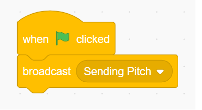

# Scratch Communication

## How do sprites communicate?

Hopefully, you can answer this question to some degree. We know now how to add two different sprites. We realized last week that each sprite has their own set of code.  This is great, however, it creates a challenge if we want them to communicate with one another.

## Welcome to Broadcast

Then

Then

### { TODO: }

- Make sure you know how to add a couple of sprites and a broadcast and receive a broadcast.

