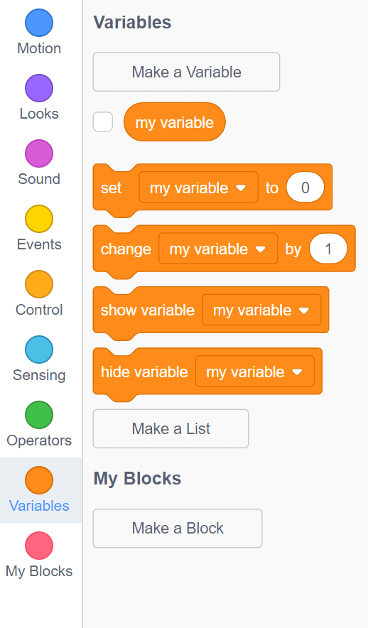
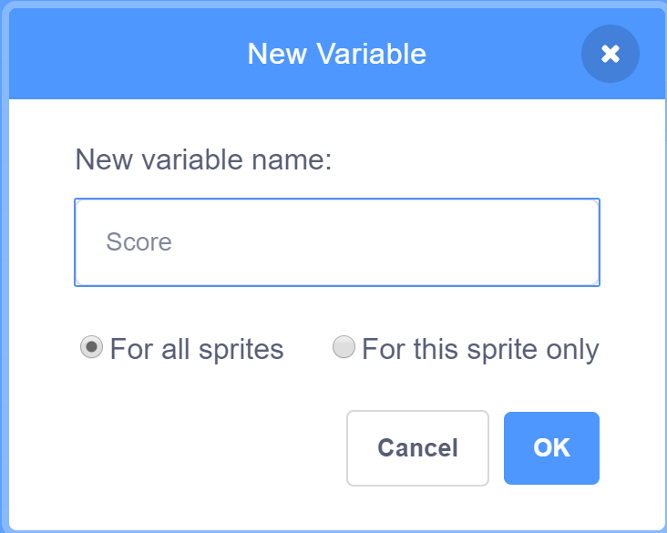
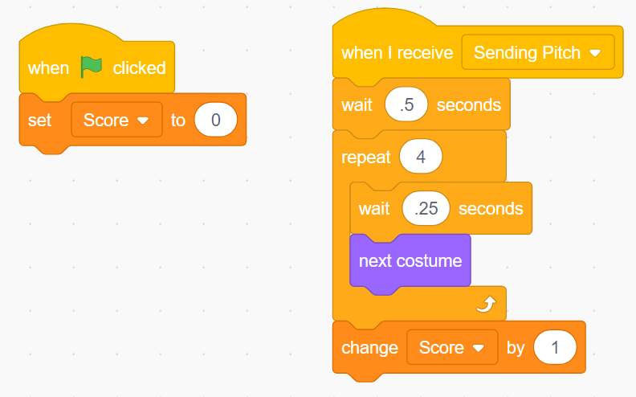

# Variables

## Variables Overview

Variables are the cornerstone of all programming.  Variables allow us to keep track of values that are used throughout a program.  They can hold different values at different times and are used for things like keeping track of the score, the time left in a game or maybe even the person's name.

Please read this [Definition of a Variable](https://www.mathsisfun.com/definitions/variable.html). 

## Variables in Scratch

For this class, we plan on using Scratch to introduce variables.

You can find them in:

Variables section.

You can create your own variable.  For example, we can call it Score.

Finally, we can react to something in our game and increase the score.

{To Do}
Make sure you can create variables and updated them and reset them.