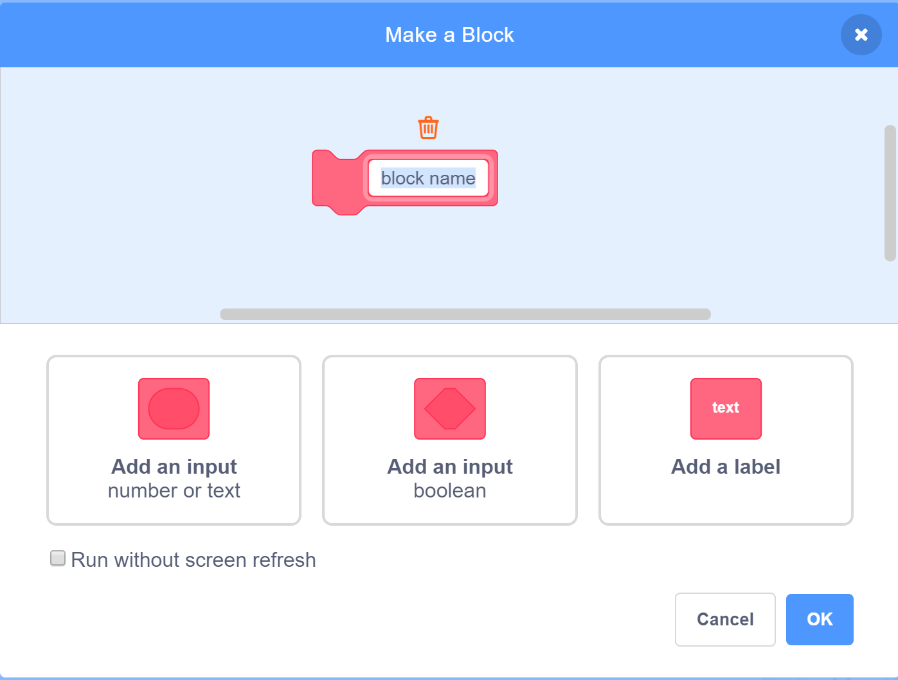
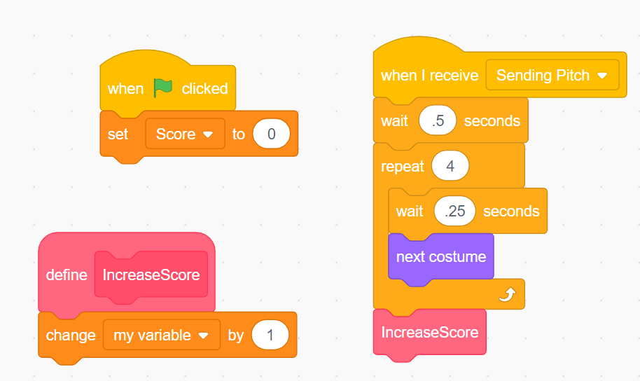

# My Blocks

One great thing about working with any programming language is the ability add your own methods (in the language they are called Blocks).

## Why Blocks?

- They allow us to create reusable code.  We want to reduce maintenance and increase reusability where ever we can.  We also want to reduce the time required to debug or find problems that happen in our code.  We saw this in Code.org.  They were called methods or functions.

## In Scratch, You can find Blocks under My Blocks

![Blocks] (../imgs/Blocks.png)

Once you click on the "My Blocks"

You will see a dialog box to create the new block.

Then, you can use your blocks throughout your code.
